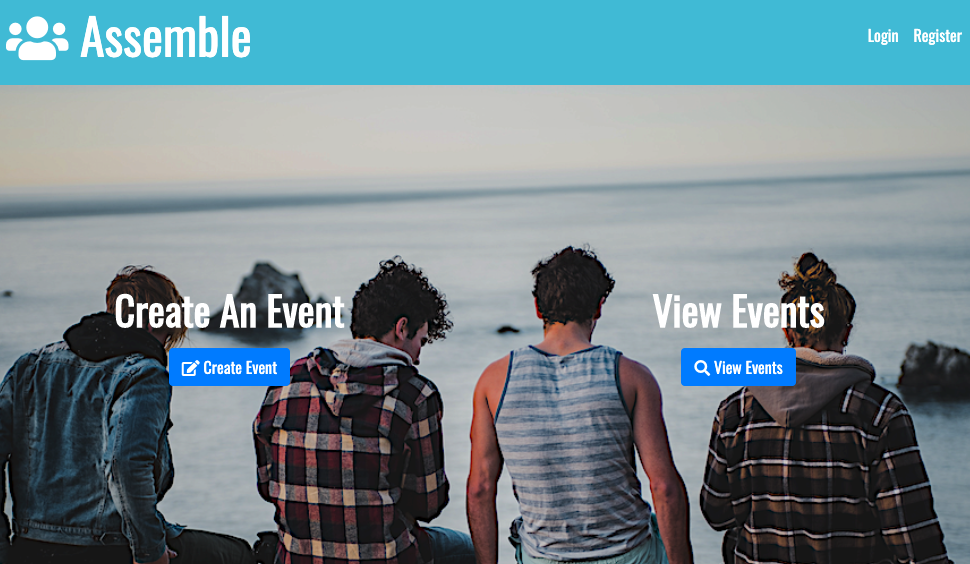

# Assemble

## Description

Assemble is a responsive website application for quickly organizing public events from exercise groups, social events, community service, and protests. Organizers are able to sign in and post an event which can be viewed by anyone using the site. Organizers can see who are interested in the event and send emails to them with event updates.

## Table of Contents

* [Description](#description)
* [User Story](#user-story)
* [Installation](#installation)
* [Usage](#usage)
* [License](#license)
* [Contributing](#contributing)
* [Tests](#tests)
* [Technology](#technology)
* [Collaborators](#collaborators)
* [Questions](#questions)
* [Deployed Application URL](#deployed-application-URL)

## User Story

As an event organizer
I want to promote the event I am organizing
I want to gather contact information for participants
So I can estimate how many people are interested
And to send more information (if any)

## Installation

No installation needed. If cloning repo do an npm install.

## Usage

Event organizers can log in and create events with a time, place, description, and category. 

Event participants do not have to log in and can view all currently active events or filter the list of events by time, place, or category. Participants are also able to become "Watchers" of a given event which will allow them to submit an email address to be used by the event organizer to notify them of any updates to the event. 

## License

## Contributing

Please follow standard contributing guidelines.

## Tests

No tests to run.

## Technology
MySQL - Database for storing Events, Users, and Watchers

Sequelize - ORM for MySQL

Express - Server framework

Passport - Stores user credentials

bcrypt - Encrypts users passwords before storage

Nodemailer - Sends emails

Bootstrap - Front-end framework

Heroku - Deployment and hosting

HTML

JavaScript

jQuery

CSS

## Collaborators
Kaeneth Dayao - https://github.com/kendayao

Alex Jeong - https://github.com/seongwoj

Joe Mastropieri - https://github.com/jcmastropieri

Tristan Postley - https://github.com/TristanPostley

## Questions

Kaeneth Dayao - https://github.com/kendayao

Alex Jeong - https://github.com/seongwoj

Joe Mastropieri - https://github.com/jcmastropieri

Tristan Postley - https://github.com/TristanPostley

## Deployed Application URL

Deployed application link: https://polar-island-19787.herokuapp.com/

Video Demo: https://giphy.com/gifs/ZBzZG6LmLuRbvnDqQV/fullscreen

